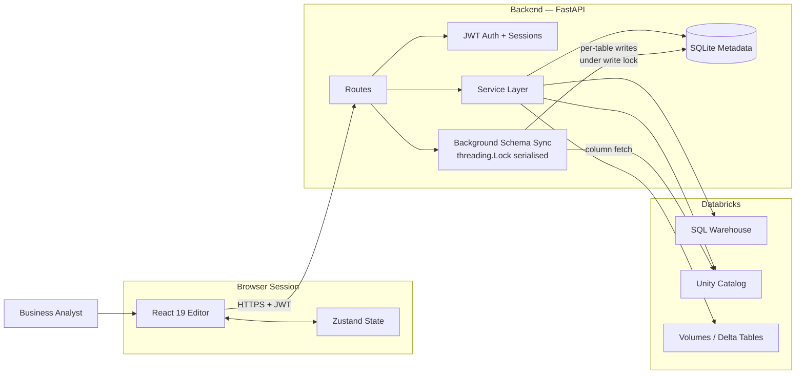
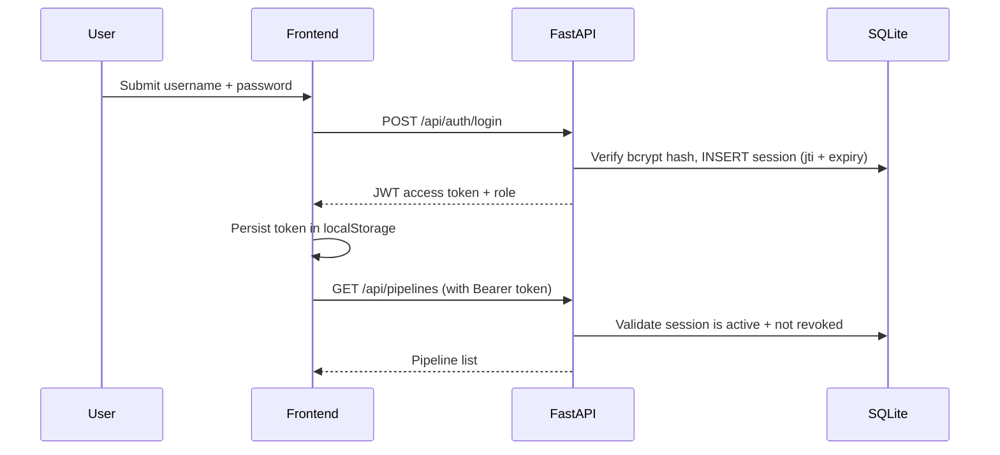
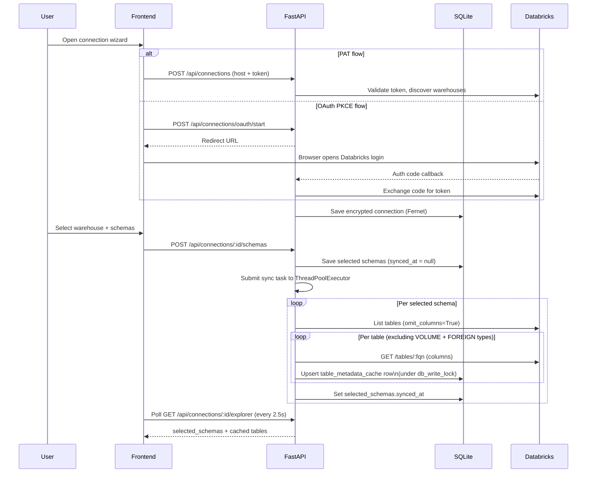
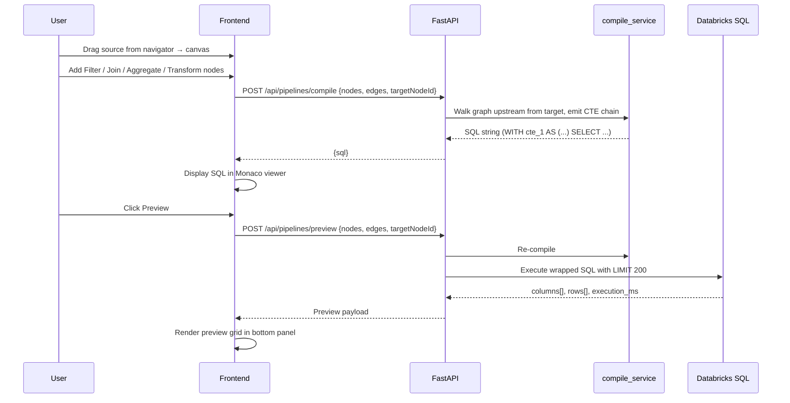
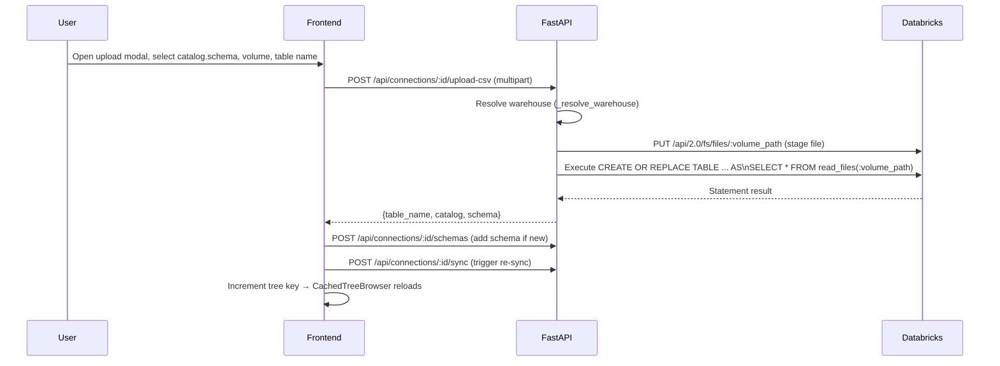
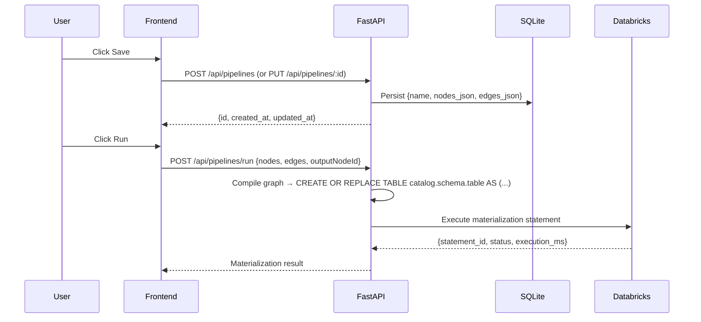

# Dataplatr — Visual Transformation Builder

**A no-code data transformation platform for business analysts.** Connect to Databricks, browse your Unity Catalog, drag sources onto a canvas, apply joins/filters/aggregations/transforms, preview real results at every step, and materialize the output — all without writing SQL.

> Repository snapshot: April 2026 · Platform focus: Databricks / Unity Catalog

---

## Documentation

- [Architecture Guide](./docs/ARCHITECTURE.md)

---

## Table of Contents

- [Why This Exists](#why-this-exists)
- [What Works Today](#what-works-today)
- [What Is Still Planned](#what-is-still-planned)
- [System Overview](#system-overview)
- [How the Main Flows Work](#how-the-main-flows-work)
- [Developer Setup](#developer-setup)
- [Configuration Reference](#configuration-reference)
- [Repository Layout](#repository-layout)
- [Technology Stack](#technology-stack)
- [Testing and CI](#testing-and-ci)
- [Recommended Next Milestones](#recommended-next-milestones)

---

## Why This Exists

Business analysts need to reshape warehouse data — joining tables, filtering rows, renaming columns, aggregating metrics — but the current path through a data engineer for every change is slow and expensive. Dataplatr gives analysts a visual interface that compiles to real SQL, executes against live Databricks warehouses, and shows them exactly what their transformation produces before it runs.

This is the first serious prototype toward that outcome. It is already beyond a demo: real auth, real Databricks execution, real pipeline persistence, and a working canvas editor.

---

## What Works Today

| Capability | Status |
|---|---|
| Authenticated login with role-based access | Working |
| JWT sessions with server-side revocation | Working |
| Pipeline catalog — create, open, save, delete | Working |
| Databricks connection via PAT or OAuth PKCE | Working |
| SQL warehouse discovery and switching | Working |
| Auto-start warehouse on app load | Working |
| Schema selection and background metadata caching | Working |
| Source import from Databricks tables and views | Working |
| CSV upload → Databricks Delta table via Volumes | Working |
| Canvas nodes: source, filter, join, aggregate, select, transform, deduplicate, output | Working |
| Backend SQL compilation from node graph | Working |
| Compiled SQL display (Monaco editor) | Working |
| Per-node live preview against Databricks (real data) | Working |
| Connection manager panel — list all connections and warehouses | Working |
| Theme support (light / dark) | Working |
| Request audit logging | Working |

---

## What Is Still Planned

| Capability | Notes |
|---|---|
| Full Run experience with output confirmation | Backend path exists; frontend connection needed |
| Domain starter templates (GL-to-reporting, etc.) | Not yet built |
| Real AI-assisted mapping and plain-English steps | Placeholder chat bar in place |
| Pipeline version history | Overwrite-only today |
| Scheduled and repeatable runs | Not yet built |
| Multi-connector support (Snowflake, BigQuery) | Databricks-first at P0 |
| Approval workflows and execution governance | Not yet built |

---

## System Overview



### What Each Layer Owns

| Layer | Responsibility |
|---|---|
| React frontend | Source browser, canvas editor, config panels, SQL view, preview grid, connection manager |
| Zustand stores | All in-memory editor state: nodes, edges, selection, previews, SQL text, connections, undo history |
| FastAPI backend | Auth, routing, pipeline CRUD, SQL compilation, preview execution, schema sync orchestration, CSV upload |
| SQLite | Platform metadata only — users, sessions, connections, pipelines, audit log, cached schema metadata |
| Databricks | Source data, SQL execution, output materialization, Unity Catalog metadata, Volume storage for CSV staging |

---

## How the Main Flows Work

### 1. Sign In



- Sessions are stored in SQLite, not just encoded in the token. Logout revokes the session record.
- Role enforcement (`admin` vs `analyst` vs `viewer`) is applied at route level.

---

### 2. Connect Databricks and Sync Metadata



- Connection secrets are Fernet-encrypted at rest.
- Schema sync is async — the API returns immediately, the browser polls.
- A `threading.Lock` (`db_write_lock`) serialises all SQLite writes so sync and audit threads never conflict.
- Volumes (`table_type = VOLUME`) are excluded from the table cache — they appear in their own Volume picker in the upload modal.

---

### 3. Build a Transformation and Preview It



- SQL is generated server-side (not in the browser).
- Preview wraps the compiled CTE chain in `SELECT * FROM (...) LIMIT 200`.
- Execution uses the warehouse associated with the pipeline's source connection.
- If the warehouse is stopped, the backend auto-starts it and polls until RUNNING (max 60s).

---

### 4. Upload a CSV File



- File is staged to a Databricks Volume, then loaded into a Delta table via `read_files()`.
- The warehouse is resolved automatically if `warehouse_id` is empty (OAuth connections).
- After upload the left panel refreshes progressively as the sync runs.

---

### 5. Save and Run a Pipeline



---

## Developer Setup

### Prerequisites

- [Docker Desktop](https://www.docker.com/products/docker-desktop/) installed and running
- Git

### Step 1 — Clone the repository

```bash
git clone https://github.com/your-org/de-platform.git
cd de-platform
```

### Step 2 — Pull the latest changes

```bash
git pull origin main
```

### Step 3 — Create the backend environment file

Copy the example and fill in your values:

```bash
cp backend/.env.example backend/.env
```

Then open `backend/.env` and set:

```env
# Required — change before running
SECRET_KEY=replace-this-with-a-random-string-at-least-32-chars
FERNET_KEY=          # generate: python -c "from cryptography.fernet import Fernet; print(Fernet.generate_key().decode())"

# Required for OAuth (leave blank if using PAT-only auth)
DATABRICKS_OAUTH_CLIENT_ID=
OAUTH_REDIRECT_URI=http://localhost:8000/api/connections/oauth/callback
FRONTEND_URL=http://localhost:3000

# Already set correctly for Docker
ALLOWED_ORIGINS=http://localhost:3000
```

> **PAT-only setup**: if you are using Personal Access Tokens only (no OAuth), you can leave `DATABRICKS_OAUTH_CLIENT_ID` and `OAUTH_REDIRECT_URI` blank. Everything else still works.

> **Frontend `.env`**: the frontend reads no secrets. Vite's `VITE_API_URL` defaults to `/api` (proxied through Nginx in Docker) — no `.env` file is needed for the Docker setup.

### Step 4 — Make `run.sh` executable

```bash
chmod +x run.sh
```

### Step 5 — Start Docker Desktop

Open Docker Desktop and wait for the whale icon in your menu bar to stop animating (engine is ready).

### Step 6 — Build and run

```bash
./run.sh
```

The first run builds both Docker images (typically 1–3 minutes). Subsequent runs use the layer cache and start in seconds.

Once running:

| Service | URL |
|---|---|
| App (frontend) | http://localhost:3000 |
| API | http://localhost:8000 |
| API docs (Swagger) | http://localhost:8000/docs |

Press `Ctrl+C` to stop. The script shuts down both containers cleanly.

### Default login (development mode)

When `ENV=development`, the backend seeds three users on first startup:

| Username | Password | Role |
|---|---|---|
| `admin` | `admin` | Admin |
| `analyst` | `analyst` | Analyst |
| `viewer` | `viewer` | Viewer |

### Changing ports

Edit `config.env` in the repo root before running:

```env
FRONTEND_PORT=3000
BACKEND_PORT=8000
```

### Local development (without Docker)

If you prefer to run services directly:

```bash
# Backend
cd backend
pip install -r requirements.txt -r requirements-dev.txt
cp .env.example .env   # edit as above
uvicorn app.main:app --reload --host 0.0.0.0 --port 8000

# Frontend (separate terminal)
cd frontend
npm ci
npm run dev
# → http://localhost:5173
```

In local dev mode the frontend Vite proxy sends `/api/*` requests to `http://localhost:8000`.

---

## Configuration Reference

### Backend — `backend/.env`

| Variable | Required | Default | Purpose |
|---|---|---|---|
| `SECRET_KEY` | Yes | — | JWT signing key. Must be ≥ 32 characters in production. |
| `FERNET_KEY` | Yes (production) | Auto-generated in dev | Encrypts stored Databricks tokens at rest. Rotating this key invalidates existing connections. |
| `ALGORITHM` | No | `HS256` | JWT signing algorithm. |
| `ACCESS_TOKEN_EXPIRE_MINUTES` | No | `60` | Session lifetime. |
| `ENV` | No | `development` | `development` seeds demo users and enables permissive defaults. Set to `production` to disable. |
| `ALLOWED_ORIGINS` | No | `http://localhost:5173` | CORS allowed origins. |
| `AUTH_DB_PATH` | No | `./data/auth.db` | Path to the SQLite metadata database. |
| `FRONTEND_URL` | For OAuth | — | Base URL of the frontend — used for OAuth callback redirects. |
| `OAUTH_REDIRECT_URI` | For OAuth | — | The backend callback URL registered in your Databricks OAuth app. |
| `DATABRICKS_OAUTH_CLIENT_ID` | For OAuth | — | Client ID from your Databricks workspace app registration. |

### Root — `config.env`

| Variable | Default | Purpose |
|---|---|---|
| `FRONTEND_PORT` | `3000` | External port for the Nginx/frontend container. |
| `BACKEND_PORT` | `8000` | External port for the FastAPI container. |

---

## Repository Layout

```
de-platform/
├── backend/
│   ├── app/
│   │   ├── auth/                  # JWT creation, validation, current-user dependency, role guards
│   │   ├── connectors/            # Databricks connector (PAT + OAuth), connector factory
│   │   ├── controllers/           # Chat controller
│   │   ├── db/                    # SQLite bootstrap, migrations, seed, db_write_lock
│   │   ├── middleware/            # Async audit middleware (fire-and-forget writes)
│   │   ├── models/                # Pydantic request/response schemas
│   │   ├── routes/                # FastAPI router — all API endpoints
│   │   └── services/
│   │       ├── audit_service.py   # Background audit writes via _audit_executor
│   │       ├── catalog_service.py # Live catalog/schema tree browsing
│   │       ├── compile_service.py # Node graph → CTE SQL compilation
│   │       ├── connection_service.py
│   │       ├── oauth_service.py   # Databricks PKCE OAuth flow
│   │       ├── pipeline_service.py
│   │       ├── query_service.py   # Preview/materialization result shaping
│   │       └── schema_cache_service.py  # Background sync, cached explorer state
│   ├── tests/
│   ├── requirements.txt
│   ├── requirements-dev.txt
│   ├── .env.example
│   └── Dockerfile
├── frontend/
│   ├── src/
│   │   ├── components/
│   │   │   ├── canvas/            # TransformationCanvas, all node types, edges, toolbar
│   │   │   ├── config/            # Per-node config panels (filter, join, aggregate, etc.)
│   │   │   ├── layout/            # AppShell, TopBar (connection/warehouse chips), panels
│   │   │   ├── navigator/         # CachedTreeBrowser, SchemaPickerModal, ObjectNavigator
│   │   │   ├── preview/           # DataPreview grid
│   │   │   └── settings/          # DatabricksConnectModal, WarehousePickerModal
│   │   ├── constants/             # Node defaults and metadata
│   │   ├── hooks/                 # useCanvasEventHandlers, useEdgeSnapInsert, useNodePreview, etc.
│   │   ├── pages/                 # LoginPage, HomePage
│   │   ├── services/              # api.ts (Axios client), apiMapper.ts
│   │   ├── store/                 # authStore, transformationStore (Zustand)
│   │   ├── types/                 # All shared TypeScript types
│   │   └── utils/                 # graphUtils, csvExport, typeUtils, canvasUtils
│   ├── package.json
│   └── Dockerfile
├── docs/
│   ├── README.md                  # ← this file
│   ├── ARCHITECTURE.md            # Technical architecture deep-dive
│   └── JOB_DESCRIPTION.md        # Role spec for inheriting engineer
├── .github/workflows/ci.yml       # GitHub Actions — lint, type check, test, build
├── config.env                     # Port configuration for Docker launcher
├── docker-compose.yml
└── run.sh                         # One-command Docker startup
```

---

## Technology Stack

### Frontend

| Concern | Choice | Notes |
|---|---|---|
| Framework | React 19 | Concurrent features, strict mode |
| Build tool | Vite | Fast HMR, ESM-native |
| State | Zustand | Lightweight, no boilerplate |
| Server state | TanStack Query | Used for connection/warehouse polling |
| Canvas | React Flow (`@xyflow/react`) | Node/edge graph rendering |
| Code editor | Monaco Editor | SQL syntax highlighting |
| Styling | Tailwind CSS + custom CSS variables | Light/dark theme via CSS custom properties |
| Testing | Vitest + Testing Library | Unit + component tests |
| Linting | ESLint + Prettier | Enforced in CI |

### Backend

| Concern | Choice | Notes |
|---|---|---|
| API framework | FastAPI 0.115 | Async, automatic OpenAPI docs |
| Runtime | Uvicorn (standard) | ASGI server with lifespan |
| Auth | python-jose + passlib/bcrypt | JWT + session revocation |
| Metadata store | SQLite (WAL mode) | Per-thread connections + `db_write_lock` |
| Warehouse SDK | `databricks-sdk >= 0.20` | Tables, warehouses, volumes, statement execution |
| Secret encryption | `cryptography` (Fernet) | Stored connection tokens encrypted at rest |
| Validation | Pydantic v2 | Request/response models |
| Testing | Pytest | Unit + integration tests |
| Linting | Ruff | Fast Python linter, enforced in CI |
| Type checking | Mypy | Static analysis, enforced in CI |

### Infrastructure

| Concern | Choice |
|---|---|
| Containerisation | Docker Compose (two services: `backend`, `frontend`) |
| Frontend serving | Nginx (Alpine) — proxies `/api/*` to backend |
| Data persistence | Docker named volume (`lakeflow_data`) — survives restarts |
| CI | GitHub Actions |

---

## Testing and CI

### Run tests locally

```bash
# Backend
pytest backend/tests -q

# Frontend
cd frontend && npx vitest run
```

### Lint and type checks

```bash
# Backend
ruff check backend/app
mypy backend/app

# Frontend
cd frontend
npx prettier --check src
npx eslint src
npx tsc -b --noEmit
```

### GitHub Actions CI

Every push and pull request runs two parallel jobs:

**Backend job** (Python 3.11):
1. Ruff lint
2. Mypy type check
3. Pytest

**Frontend job** (Node 20):
1. Prettier format check
2. ESLint
3. TypeScript compile check (`tsc -b --noEmit`)
4. Vitest
5. Vite production build

All steps must pass for a PR to be mergeable.

---

## Recommended Next Milestones

### Immediate (P0 completeness)

1. **Wire the Run flow**: the backend `/api/pipelines/run` endpoint exists and works. Connect it to the main toolbar Run button with a proper loading state and confirmation of the materialized output table.
2. **First starter template**: a GL-to-reporting workflow (Oracle EBS → journal headers → aggregated P&L) as a pre-loaded pipeline that analysts can clone and adapt.
3. **Assistant grounding**: replace the placeholder chat bar with a real prompt that uses the active schema context (table names, column names, types) to suggest transformations.

### Near-term (product quality)

1. **Pipeline version history**: snapshot previous saves so analysts can recover from bad transformations.
2. **Better error surfaces**: distinguish connection failures, warehouse timeouts, and SQL errors clearly in the UI.
3. **Scheduled runs**: allow a saved pipeline to be triggered on a cron schedule and store execution history.
4. **Snowflake connector**: broaden beyond Databricks once the Databricks workflow is fully solid.

---

## Notes for the Next Engineer

- The architecture is intentionally simple for this stage. SQLite will need to be replaced if the platform moves to multi-user SaaS.
- The `db_write_lock` in `backend/app/db/auth_db.py` is the critical guard preventing SQLite lock contention between the schema sync threads and the audit writer thread. Do not remove it without replacing it with an equivalent serialisation mechanism.
- OAuth token refresh is implemented but Databricks short-lived tokens require the refresh flow to be tested against a production workspace.
- The current product spec and connector focus are both Databricks-first. Resolve the warehouse strategy before making large architectural investments.
