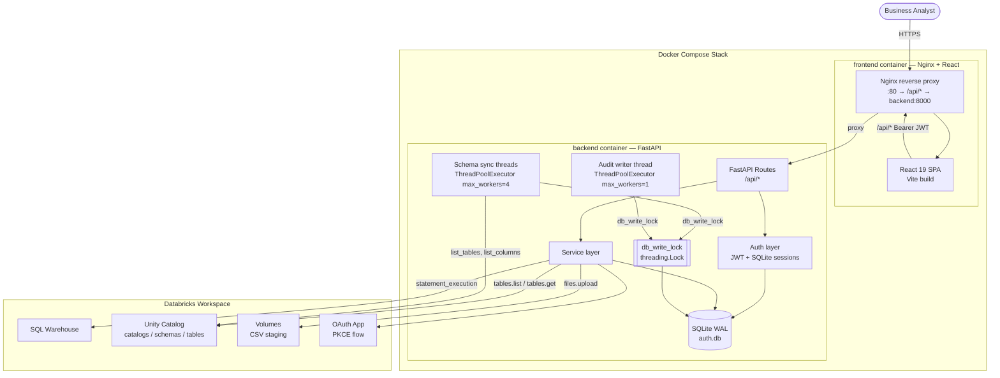
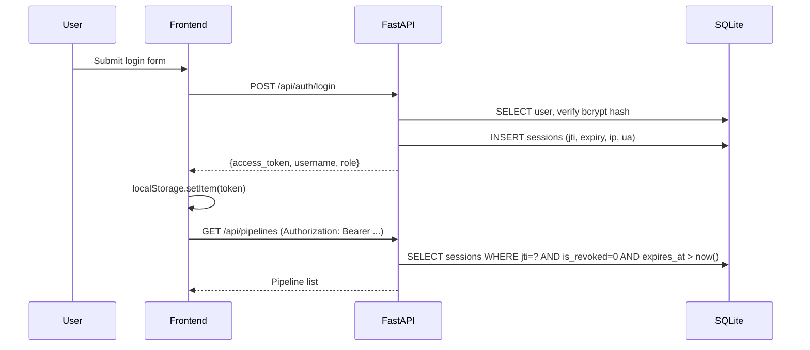
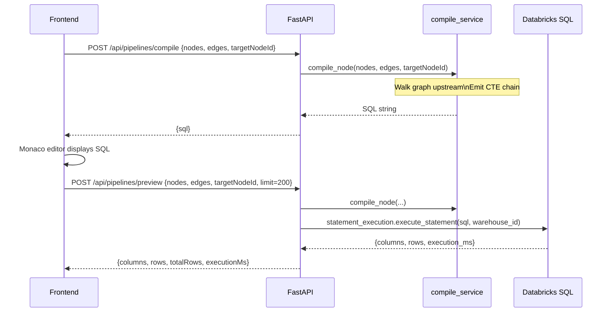
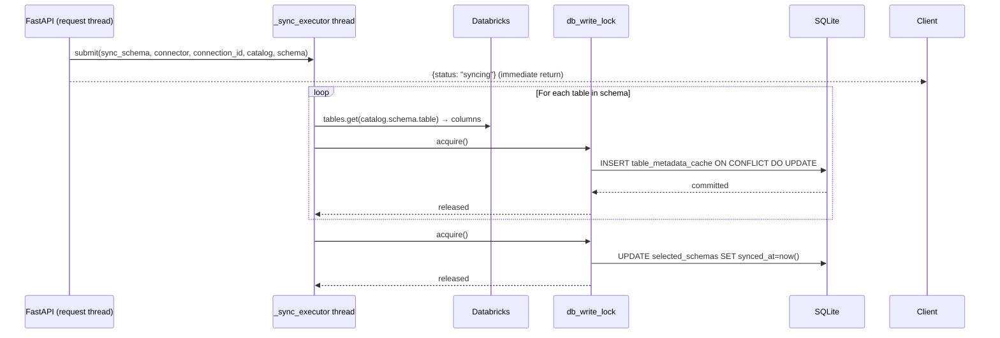

# Architecture Guide — Dataplatr Visual Transformation Builder

Technical reference for engineers inheriting or extending this codebase.

> Repository snapshot: April 2026

---

## Related Documents

- [Project README](../README.md)

---

## Table of Contents

- [Intended Audience](#intended-audience)
- [Architectural Summary](#architectural-summary)
- [System Context Diagram](#system-context-diagram)
- [Guiding Principles](#guiding-principles)
- [Frontend Architecture](#frontend-architecture)
- [Backend Architecture](#backend-architecture)
- [Data Ownership](#data-ownership)
- [Critical Implementation Details](#critical-implementation-details)
- [Core Runtime Flows](#core-runtime-flows)
- [Component Map](#component-map)
- [Extension Points](#extension-points)
- [Known Constraints and Tradeoffs](#known-constraints-and-tradeoffs)
- [Recommended Architecture Decisions for the Next Owner](#recommended-architecture-decisions-for-the-next-owner)

---

## Intended Audience

- Engineers inheriting or extending this codebase
- Product owners understanding implementation boundaries
- Technical reviewers evaluating the prototype before next investment

---

## Architectural Summary

The current system is a **single-tenant web application** with:

- a React 19 frontend (Vite, Zustand, React Flow),
- a FastAPI backend (Python 3.11, SQLite, Databricks SDK),
- one SQLite database for all platform metadata,
- one Databricks connector (PAT + OAuth PKCE),
- background threads for schema sync (serialised via `threading.Lock`),
- and Nginx proxying `/api/*` to FastAPI inside Docker.

There is no message queue, no separate worker process, and no orchestration layer.

---

## System Context Diagram



---

## Guiding Principles

### 1. The warehouse stays the source of truth for data

SQLite stores platform metadata only (users, sessions, connections, pipelines, schema cache). It never mirrors row data. Databricks owns all actual data, SQL execution, and output tables.

### 2. SQL is compiled server-side

The backend `compile_service` converts the node graph to a CTE chain. The frontend never generates executable SQL. This keeps execution logic in one place and makes the output auditable.

### 3. Metadata caching makes the source browser feel instant

Browsing Unity Catalog live is slow (one API call per table). The `schema_cache_service` caches table and column metadata in SQLite after a background sync, so the explorer loads in milliseconds on subsequent opens.

### 4. One write lock prevents SQLite contention

SQLite WAL mode allows concurrent readers but only one writer at a time. Rather than relying on `busy_timeout`, a `threading.Lock` (`db_write_lock` in `auth_db.py`) is acquired by every thread before any write+commit. This makes it physically impossible for two write transactions to overlap.

### 5. Keep the deployment shape simple

Single Docker Compose stack. No Kubernetes, no queues, no separate worker. Appropriate for prototype/design-partner stage.

---

## Frontend Architecture

### Layout Zones

The editor uses a **three-panel layout** managed by `AppShell.tsx`:

```
┌────────────────────────────────────────────────────────────────────┐
│  TopBar — pipeline name, connection chip, warehouse chip, Run/Save  │
├─────────────┬──────────────────────────────────────┬───────────────┤
│ Left Panel  │  Center Panel                        │ Right Panel   │
│             │  ┌─────────────────────────────────┐ │               │
│ Source      │  │ CanvasToolbar (node type buttons)│ │ Step History  │
│ Navigator   │  ├─────────────────────────────────┤ │               │
│             │  │                                 │ │ Node Config   │
│ CachedTree  │  │  TransformationCanvas           │ │ Panel         │
│ Browser     │  │  (React Flow graph)             │ │               │
│             │  │                                 │ │ Generated SQL │
│             │  ├─────────────────────────────────┤ │ (Monaco)      │
│             │  │ ChatPromptBar                   │ │               │
│             │  ├─────────────────────────────────┤ │               │
│             │  │ DataPreview grid                │ │               │
└─────────────┴──────────────────────────────────────┴───────────────┘
```

### State Model

Two Zustand stores:

**`authStore`** — Persisted to `localStorage`:
- `token` (JWT string)
- `user` (`{ username, role }`)
- `isAuthenticated`

**`transformationStore`** — In-memory, rehydrated from API on pipeline load:
- `connections` — all Databricks connections for the current user
- `pipelineConnectionAlias` — which connection the active pipeline uses
- `warehouseState` — `'STARTING' | 'RUNNING' | null` (polled on load)
- `nodes`, `edges` — the graph definition
- `selectedNodeId` — drives config panel and preview
- `previewData`, `previewLoading`, `previewError`
- `generatedSQL` — compiled SQL for the selected node
- `pipelineId`, `pipelineName`, `isDirty`
- `chatMessages`, `chatLoading`
- `history` (undo/redo stack)
- `treeKey` — increment to force `CachedTreeBrowser` reload after CSV upload

### Canvas and Node Types

Canvas is rendered by `@xyflow/react`. Each node type is a React component registered in the `nodeTypes` map:

| Node Type | File | Config Component |
|---|---|---|
| `source` | `SourceNode.tsx` | (inline — no config panel) |
| `filter` | `BaseNode.tsx` | `FilterConfig.tsx` |
| `join` | `BaseNode.tsx` | `JoinConfig.tsx` |
| `aggregate` | `BaseNode.tsx` | `AggregateConfig.tsx` |
| `select` | `SelectNode.tsx` | `SelectConfig.tsx` |
| `transform` | `TransformNode.tsx` | `TransformConfig.tsx` |
| `deduplicate` | `DeduplicateNode.tsx` | `DeduplicateConfig.tsx` |
| `output` | `OutputNode.tsx` | `NodeConfigPanel.tsx` (output section) |

**Edge snap insertion**: dropping a node type from the toolbar onto or near an existing edge automatically splits the edge and wires the new node in (`useEdgeSnapInsert.ts`).

### Source Navigator — CachedTreeBrowser

The left panel uses `CachedTreeBrowser` (not `UnityTreeBrowser`) by default:

1. On mount: `GET /api/connections/:id/explorer` — reads SQLite cache (<10ms, no Databricks call).
2. While any `selected_schema.synced_at = null`: polls every 2.5s so tables appear progressively as the background sync completes.
3. Each table row is draggable — drag payload is `application/lakeflow-node` JSON with the full column schema.
4. Per-schema ↻ button triggers a background re-sync.

### Warehouse Auto-Start

`AppShell.tsx` runs an effect on mount that:
1. Calls `POST /api/connections/:id/warehouse/start`.
2. Polls `GET /api/connections/:id/warehouse/status` every 3s.
3. Stops after 20 polls (60s max) or when state becomes `RUNNING`.
4. Uses a `useRef` to cancel the poll on component unmount.

### Theme

Light/dark mode toggled via `ThemeContext`. Theme is applied as a `data-theme` attribute on `<html>` and consumed through CSS custom properties (`--bg-1`, `--text-1`, `--accent`, etc.) defined in `index.css`. No Tailwind `dark:` variants are used — all color overrides go through the CSS variables.

---

## Backend Architecture

### Request Path

```
Browser
  → Nginx (port 80)
  → [proxy /api/*]
  → FastAPI Uvicorn (port 8000)
  → AuditMiddleware.dispatch()
    → call_next(request)            ← actual route handler runs here
    → log_activity() submitted to _audit_executor (fire-and-forget)
  → JWT validation (Depends(get_current_user))
  → Route function
  → Service layer
  → SQLite or Databricks
```

### Route Inventory (`/api`)

| Method | Path | Purpose |
|---|---|---|
| GET | `/health` | Health check |
| POST | `/auth/login` | Issue JWT + session |
| POST | `/auth/logout` | Revoke session |
| GET/POST | `/users` | User management (admin) |
| GET | `/audit` | Audit log (admin) |
| GET/POST/PUT/DELETE | `/connections` | Connection CRUD |
| POST | `/connections/oauth/start` | Begin Databricks PKCE flow |
| GET | `/connections/oauth/callback` | Exchange OAuth code |
| GET | `/connections/:id/warehouse/status` | Warehouse state |
| POST | `/connections/:id/warehouse/start` | Start warehouse |
| GET | `/connections/:id/warehouses` | List all warehouses |
| PUT | `/connections/:id` | Update warehouse/upload config |
| GET | `/connections/:id/tree` | Live catalog list |
| GET | `/connections/:id/tree/:catalog` | Live schema list |
| GET | `/connections/:id/tree/:catalog/:schema` | Live table list |
| GET | `/connections/:id/tree/:cat/:sch/volumes` | List volumes |
| POST | `/connections/:id/tree/:cat/:sch/volumes` | Create volume |
| GET | `/connections/:id/explorer` | Cached explorer state |
| POST | `/connections/:id/schemas` | Add selected schema + trigger sync |
| DELETE | `/connections/:id/schemas/:cat/:sch` | Remove selected schema |
| POST | `/connections/:id/sync` | Re-sync all selected schemas |
| GET | `/connections/:id/cached-tables` | Read table metadata cache |
| POST | `/upload-csv` | Stage CSV → Databricks Delta table |
| POST | `/pipelines/compile` | Graph → SQL |
| POST | `/pipelines/preview` | Execute preview query |
| POST | `/pipelines/run` | Execute materialization |
| GET/POST | `/pipelines` | Pipeline list/create |
| GET/PUT/DELETE | `/pipelines/:id` | Pipeline CRUD |
| POST | `/chat` | AI chat (stub) |

### Service Layer

| Service | Responsibility |
|---|---|
| `compile_service` | Walks node graph upstream from target, emits a CTE-chained SQL string. One function per node type. |
| `pipeline_service` | SQLite CRUD for pipeline records. Serialises nodes/edges as JSON. |
| `connection_service` | Creates/updates connection records. Encrypts tokens with Fernet before storage. |
| `schema_cache_service` | Adds/removes selected schemas; background sync (list tables + columns); read cache. All writes under `db_write_lock`. |
| `catalog_service` | Live Unity Catalog tree browsing (catalogs → schemas → tables) without caching. |
| `query_service` | Wraps preview result DTOs into JSON-serialisable shape. |
| `oauth_service` | Databricks PKCE — generates state, builds redirect URL, exchanges code for token, stores refresh token. |
| `audit_service` | Non-blocking audit writes via `_audit_executor` (single thread). Always acquires `db_write_lock` before commit. |

### SQL Compilation

`compile_service.py` uses a recursive `_compile_node` function:

1. Walk the edge graph upstream from the selected output node.
2. For each node, emit a named CTE: `cte_{nodeId}`.
3. Node-type-specific SQL generation:
   - **source**: `SELECT * FROM catalog.schema.table`
   - **filter**: `SELECT * FROM upstream WHERE <conditions>`
   - **join**: `SELECT ... FROM left JOIN right ON <conditions>`
   - **aggregate**: `SELECT <groupBy>, <measures> FROM upstream GROUP BY <groupBy>`
   - **select**: `SELECT <column aliases> FROM upstream`
   - **transform**: `SELECT <cast/rename/expression columns> FROM upstream`
   - **deduplicate**: `SELECT * FROM (SELECT *, ROW_NUMBER() OVER (PARTITION BY ... ORDER BY ...) AS _rn FROM upstream) WHERE _rn = 1`
   - **output**: wraps upstream CTE in `CREATE OR REPLACE TABLE catalog.schema.table AS (...)`
4. Returns `WITH cte_1 AS (...), cte_2 AS (...) SELECT * FROM cte_N`.

### Databricks Connector

`DatabricksConnector` wraps the `databricks-sdk` `WorkspaceClient`:

```python
class DatabricksConnector:
    client: WorkspaceClient         # SDK client
    warehouse_id: str               # resolved at runtime if empty

    def _resolve_warehouse()        # finds first RUNNING warehouse if warehouse_id=""
    def list_tables()               # excludes VOLUME + FOREIGN types
    def list_columns()              # GET /tables/:fqn, returns column metadata
    def list_volumes()              # volumes.list() for a catalog.schema
    def create_volume()             # VolumeType.MANAGED inline creation
    def list_warehouses()           # warehouses.list()
    def get_warehouse_state()       # warehouses.get().state
    def start_warehouse()           # warehouses.start()
    def execute_preview()           # statement_execution.execute_statement() with LIMIT
    def upload_csv()                # files.upload() → read_files() CTAS
    def materialize()               # CTAS execution
```

**Volume filtering**: `list_tables()` filters `table_type.value not in {'VOLUME', 'FOREIGN'}` so volumes never appear in the table cache or source explorer.

**Warehouse auto-discovery**: if `warehouse_id` is empty (OAuth connections), `_resolve_warehouse()` calls `warehouses.list()`, picks the first RUNNING warehouse (or the first available), and sets it for the lifetime of that connector instance.

### SQLite Write Serialisation

```python
# auth_db.py
db_write_lock = threading.Lock()   # module-level, shared by all threads

# Usage in every writer:
with db_write_lock:
    conn = get_auth_conn()          # thread-local connection
    conn.execute(...)
    conn.commit()
```

This pattern is used in:
- `schema_cache_service.sync_schema` — one `with db_write_lock` block per table row + one for the `synced_at` update
- `schema_cache_service.add_schema`, `remove_schema`
- `audit_service._write_log` — runs inside `_audit_executor` (single thread), still acquires lock

**Why not `busy_timeout`?** Python's `sqlite3` module doesn't reliably retry across thread boundaries when `busy_timeout` is set via PRAGMA — the C-level busy handler fires on `sqlite3_step()` failures, but Python's own transaction management layer can raise `OperationalError: database is locked` before that point. The `threading.Lock` is a reliable Python-level guarantee.

---

## Data Ownership

### SQLite Tables (`auth.db`)

| Table | What it stores | Why |
|---|---|---|
| `users` | Username, email, bcrypt hash, role, active status | Authentication |
| `sessions` | JWT `jti`, expiry, IP, user agent, revocation flag | Server-side session revocation |
| `audit_log` | Every API request — method, path, status, timing, user | Auditability |
| `pipelines` | Pipeline name, `nodes_json`, `edges_json`, timestamps | Pipeline persistence |
| `connections` | Host, Fernet-encrypted token, warehouse ID, upload config, OAuth fields | Secure connection reuse |
| `selected_schemas` | `(connection_id, catalog, schema, synced_at)` | Controls which schemas appear in the source browser |
| `table_metadata_cache` | Table name, type, `columns_json`, `synced_at` | Fast source browser without live Databricks calls |

### Databricks Ownership

| Resource | Who owns it |
|---|---|
| Source tables and views | Databricks Unity Catalog |
| SQL execution | Databricks SQL Warehouse |
| Output Delta tables | Databricks Unity Catalog |
| CSV staging | Databricks Volumes |
| OAuth identity | Databricks workspace app |

The application is the **control plane**. It never becomes a data warehouse.

---

## Critical Implementation Details

### 1. Schema Sync — Progressive Table Appearance

`sync_schema()` in `schema_cache_service.py`:

```
For each table in schema:
    1. GET columns from Databricks (network I/O, no lock held)
    2. Acquire db_write_lock
    3. INSERT/UPDATE one row in table_metadata_cache
    4. COMMIT
    5. Release db_write_lock
After all tables:
    Acquire db_write_lock → UPDATE selected_schemas.synced_at → COMMIT
```

Tables appear in the frontend progressively as each one is inserted, because `CachedTreeBrowser` polls every 2.5s while `synced_at IS NULL`.

### 2. Audit Writes — Non-Blocking

`audit_service.py` submits every write to `_audit_executor` (a single `ThreadPoolExecutor` thread). The request completes before the audit write finishes. The audit thread also acquires `db_write_lock`, so it never conflicts with sync writes.

### 3. Connection Manager Panel

`TopBar.tsx` renders two clickable chips:
- **"N Connection(s)"** — opens `ConnectionPanel` showing all connections with active indicator, delete on hover, and "Add connection" action.
- **Warehouse chip** — same panel, second section lists all warehouses for the active connection with current state indicator; "Use this" switches the active warehouse.

Both chips toggle a shared `showConnPanel` state. Click-outside closes the panel.

### 4. CSV Upload Flow

1. Frontend opens `SourceImportModal` → `LocalFileTab`.
2. User selects file, picks catalog/schema from searchable dropdown (`CatalogSchemaSearch`), picks volume from `VolumeSelect` (auto-discovered; inline create if none exist).
3. `POST /upload-csv` with multipart form (file + catalog + schema + table_name + upload_volume).
4. Backend: `_resolve_warehouse()` → stage file to `/Volumes/{cat}/{sch}/{vol}/{filename}` → `CREATE OR REPLACE TABLE ... AS SELECT * FROM read_files(...)`.
5. On success: `addSchema` + `syncSchemas` API calls + increment `treeKey` → `CachedTreeBrowser` reloads and begins polling.

---

## Core Runtime Flows

### Authentication



### Pipeline Compile + Preview



### Background Schema Sync



---

## Component Map

### Frontend Components

| Component | Path | Purpose |
|---|---|---|
| `AppShell` | `layout/AppShell.tsx` | Top-level editor layout, warehouse auto-start polling |
| `TopBar` | `layout/TopBar.tsx` | Connection chip, warehouse chip, `ConnectionPanel` |
| `CenterPanel` | `layout/CenterPanel.tsx` | Canvas + toolbar + chat + preview |
| `RightPanel` | `layout/RightPanel.tsx` | Config/history/SQL tabs |
| `TransformationCanvas` | `canvas/TransformationCanvas.tsx` | React Flow instance, drag-to-add, undo/redo |
| `CanvasToolbar` | `canvas/CanvasToolbar.tsx` | Node type buttons |
| `SourceImportModal` | `canvas/SourceImportModal.tsx` | CSV upload (single-step form with catalog/schema search + volume picker) |
| `ObjectNavigator` | `navigator/ObjectNavigator.tsx` | Wraps `CachedTreeBrowser`, adds schema picker and refresh |
| `CachedTreeBrowser` | `navigator/CachedTreeBrowser.tsx` | SQLite-backed explorer with polling |
| `SchemaPickerModal` | `navigator/SchemaPickerModal.tsx` | Add a new catalog.schema to the explorer |
| `NodeConfigPanel` | `config/NodeConfigPanel.tsx` | Right-panel config for selected node |
| `DataPreview` | `preview/DataPreview.tsx` | Preview result grid |
| `DatabricksConnectModal` | `settings/DatabricksConnectModal.tsx` | Connection creation wizard |
| `WarehousePickerModal` | `settings/WarehousePickerModal.tsx` | Warehouse selection for a connection |

### Backend Services

| Service | Key Functions |
|---|---|
| `compile_service` | `compile_node()`, `_compile_source()`, `_compile_filter()`, `_compile_join()`, etc. |
| `pipeline_service` | `get_pipeline()`, `create_pipeline()`, `update_pipeline()`, `delete_pipeline()` |
| `connection_service` | `create_connection()`, `get_connections()`, `update_connection()` |
| `schema_cache_service` | `sync_schema()`, `sync_all_schemas()`, `get_cached_tables()`, `get_explorer_state()`, `add_schema()`, `remove_schema()` |
| `catalog_service` | `list_catalogs()`, `list_schemas()`, `list_tables_live()` |
| `oauth_service` | `start_oauth()`, `handle_callback()`, `refresh_token()` |
| `query_service` | `shape_preview_result()` |
| `audit_service` | `log_activity()` (non-blocking), `get_audit_log()` |

---

## Extension Points

### Add a New Node Type

1. Add the type string to `NodeType` in `frontend/src/types/index.ts`.
2. Add a config interface and include it in the `NodeConfig` union.
3. Create the node React component in `frontend/src/components/canvas/nodes/`.
4. Create the config panel component in `frontend/src/components/config/`.
5. Register both in `TransformationCanvas.tsx` (`nodeTypes` map) and `NodeConfigPanel.tsx`.
6. Add the toolbar button in `CanvasToolbar.tsx` with icon and default config in `nodeDefaults.ts`.
7. Add SQL generation in `backend/app/services/compile_service.py`.

### Add a New Connector (e.g. Snowflake)

1. Create `backend/app/connectors/snowflake_connector.py` implementing the `BaseConnector` protocol.
2. Register it in `backend/app/connectors/factory.py`.
3. Add connection form fields in `DatabricksConnectModal.tsx` (or create a separate modal).
4. Add any new API routes for Snowflake-specific operations.

### Add Version History

1. Add a `pipeline_versions` table to `auth_db.py` (snapshot of `nodes_json` + `edges_json` + `created_at`).
2. Extend `pipeline_service.py` to write a version record on each save.
3. Add a version history panel to the right panel.

### Swap SQLite for PostgreSQL

1. Replace `auth_db.py` with a SQLAlchemy connection pool or `asyncpg`.
2. Remove `db_write_lock` — PostgreSQL handles concurrent writers natively.
3. Keep the service layer API identical — all SQLite-specific code is inside `auth_db.py` and the service layer.

---

## Known Constraints and Tradeoffs

### Good for the current stage

| Tradeoff | Reasoning |
|---|---|
| SQLite for metadata | Lightweight, zero operational overhead, good enough for single-process |
| In-process background sync | No Celery/Redis/worker needed at this scale |
| Single router module | Easy to scan the full API surface |
| Server-side SQL compilation | All execution logic in one place |
| Fernet token encryption | Simple, correct, well-supported |

### Will need revisiting at scale

| Issue | Impact | Future direction |
|---|---|---|
| SQLite as metadata store | Concurrent multi-user writes, backups, migrations become awkward | PostgreSQL or Turso |
| In-process background threads | Won't survive multi-instance deployment | Celery + Redis or similar |
| Single large router module | Harder to navigate as surface area grows | Split into sub-routers by domain |
| No execution history | Can't recover from failed runs or review past materializations | Durable execution records table |
| No pipeline version history | Overwrites on every save | Versioned snapshot model |
| Databricks-only connector | Limits addressable market | Connector protocol + factory are in place |

---

## Recommended Architecture Decisions for the Next Owner

### Immediate

1. **Wire the Run button** to `/api/pipelines/run` with a loading state and success confirmation.
2. **Settle the warehouse strategy**: Databricks-first through P0, then decide when to add Snowflake.
3. **Add an `.env.example`** file so new developers don't need to read docs to know what to configure.

### Short-term

1. **Pipeline version snapshots**: write a version record on every save; add a simple version history UI.
2. **Durable execution records**: store run results (statement ID, status, duration, output table) in SQLite so analysts can review what ran.
3. **Better error surfaces**: distinguish connection failures, warehouse start failures, SQL errors, and compile errors in the UI with actionable messages.

### Medium-term

1. **Move sync to a proper queue**: once deployed to multi-instance, in-process threads don't survive. Add Redis + Celery or a lightweight job table + polling worker.
2. **Replace SQLite**: when multi-user concurrency or collaboration requirements appear.
3. **Real AI assistance**: ground the chat bar in the active schema (catalog/schema/table/column context) to make suggestions useful.
4. **Snowflake connector**: implement `SnowflakeConnector` against the existing `BaseConnector` protocol.

---

## Bottom Line

The architecture is well-structured for a prototype at this stage. The editor model, backend compile path, metadata caching strategy, write-lock-serialised SQLite, and Databricks integration are all solid starting points for a production-grade product.

What is missing is not structure — it is the next round of product decisions (run history, scheduling, AI grounding, connector expansion) and the operational maturity (move sync out of in-process threads, replace SQLite for multi-user scale) that turn this from a strong prototype into a platform.
